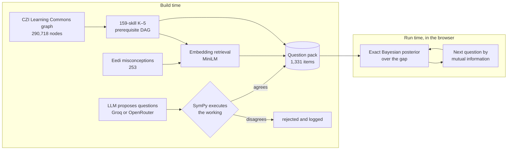

# Taproot

**A K–5 maths game that finds the gap underneath the problem a child is stuck on.**

> A taproot is the one deep root everything above depends on.

A fifth grader fails `3/4 + 1/6`. Most maths apps respond with more fractions.
She is rarely failing fractions. She is usually missing something from a grade
or three earlier that fractions are built on. Taproot treats the failed problem
as a symptom, digs down a real prerequisite graph to the idea that is actually
broken, repairs it hands-on, and climbs back to the problem that beat her.

**Live:** https://sham-puttane.github.io/Taproot-Nerdy-AI-Hackathon/

Built for the Nerdy AI Hackathon, Prompt 01: K–5 Math Game.

---

## The game

The prompt asks for mechanics that encourage steady progression and reward
mastery. In Taproot the diagnosis *is* the mechanic.

| Beat | What happens |
|---|---|
| **The problem** | She tries a question at her grade and gets it wrong. No score, no timer. |
| **Digging** | Each question is chosen to narrow down where the break is. A root grows down through the grade strata, and where it changes subject, tapping it explains why. |
| **Found it** | The broken skill is named in words a child can read, with the grade it lives in and how sure the engine is. |
| **Fixing** | A manipulative: number line, array, balance or strip diagram. |
| **The Cascade** | Every skill that was standing on the repaired one lights up in turn. That is the reward. |
| **Climbing back** | She returns up the chain to the problem that beat her. |
| **The Grove** | Her persistent world: one tree per topic, roots reaching as deep as she has dug. One repair can feed several trees, because topics genuinely rest on each other. |

There are no points, XP, streaks or timers, by design. Gamification research
finds extrinsic rewards can undermine the motivation they are meant to create
and do little for competence, which is the one need a diagnostic engine is
built to meet. So the reward is evidence: real skills from the real graph.

### Also in the product

- **Speaks and listens.** Questions are read aloud by default, with maths
  rewritten for the ear, and she can answer by voice. Children behind in maths
  are often behind in reading, and a word problem should not be a reading test.
- **Several learners on one device.** Each child has their own grove, chosen by
  colour and initial. No accounts, and names never leave the device.
- **A report for the grown-up.** Every question she was asked and, for each
  wrong answer, what that particular answer means. It persists after the
  session, alongside strength by topic, where her gaps cluster by grade, and
  every repair so far.
- **Offline.** The core game runs from a cached question pack with no network.

---

## How it works

The work is split between **build time**, where models and heavy data live,
and **run time**, where a child is playing and nothing can be allowed to fail.



**The graph.** The CZI Learning Commons knowledge graph (Common Core, with
learning progressions from Student Achievement Partners' Coherence Map) is
reduced from 290,718 nodes and 499,498 relationships to a verified acyclic
K–5 graph of 159 skills and 277 prerequisite edges. Every skill has a
child-facing name.

**Misconceptions.** Eedi's expert-authored misconceptions are mapped onto the
graph's learning components by embedding similarity, with an accept floor, a
review band and a hand-scored sample, so the mapping accuracy is measured.
Anything below the floor is left unmapped rather than forced.

**Questions: the model proposes, SymPy disposes.** An LLM writes
textbook-style questions and must show its working as a computable expression.
SymPy executes that expression and the item is rejected unless the author's
own arithmetic produces the answer it claimed. Each wrong option carries its
own reason, which the grown-up report quotes back. Further gates check
grade-appropriate numbers, a reading-length budget per grade, and that every
number in the working appears in the question. A weak model therefore costs
yield, never correctness. Manipulative items are generated deterministically.

**The engine.** Knowledge is monotone along the DAG, so a question at a skill
is a noisy test of whether the gap sits at or above it. That makes the gap's
identity a plain categorical, updated in closed form after every answer, and
the next question is the one with the most mutual information. The same
TypeScript is imported as source by the browser and by the evaluation harness,
so they cannot drift apart.

**Voice.** Both directions use the browser's Web Speech API, so there is no key
and no voice vendor. Spoken answers are matched against the options on screen,
including number words and spoken fractions, rather than parsed as free speech.

**Zero model calls at run time.** No key in the browser, nothing to rate
limit, and no provider outage that can take a lesson down.

---

## Does it work?

Every figure here is against **simulated learners** with slip and guess noise,
not real children. That is a controlled test of the search, not evidence of
learning outcomes.

**Across every topic and grade the game offers** (16 combinations, 150 trials
each), from [`engine/eval/sections.md`](engine/eval/sections.md):

| Exact gap | Within one prerequisite | Questions |
|---|---|---|
| **73.2%** | **84.1%** | **10.9** |

**Against baselines** on one wall (`5.NF.A.1`, 200 learners), where every policy
shares the same belief model and stopping rule, from
[`engine/eval/results.md`](engine/eval/results.md):

| Policy | Questions | Exact gap | Within one |
|---|---|---|---|
| **Taproot** | 13.5 | **71.5%** | **88.0%** |
| Curriculum order | 22.8 | 9.5% | 9.5% |
| Random adaptive | 23.7 | 2.0% | 2.5% |
| Worksheet | 20.0 | 0% | 0% |

A worksheet scores zero because it cannot name a cause at all.

Two results that cut against the design are recorded rather than dropped. A
plausible recency prior made accuracy worse (71.5% to 65.5%) and is switched
off, with the measurement kept in `engine/src/diagnosis.ts`. And the engine's
first version, which spread belief through the graph, scored 39%; replacing it
with the exact posterior is what reached 71.5%.

---

## Known limits

- **No real learners yet.** The numbers above are simulation.
- **18% of questions** still come from a generic arithmetic fallback, and only
  3 of the 253 retrieved misconceptions are executable as wrong algorithms.
- **Voice input** uses Chrome's speech recogniser, which sends audio to Google
  and needs a connection. The microphone hides itself when unavailable, and
  every question is answerable by tapping.
- **Progress is per browser.** Clearing site data clears it.

---

## Run it

```bash
# the game
cd app && npm install && npm run dev          # http://localhost:5173

# tests
cd engine && npm install && npm test          # engine, 23 tests
python -m pytest agents                       # verifier, 48 tests

# evaluations, from engine/
npx tsx eval/sections.ts 150 > eval/sections.json   # every topic and grade
npx tsx eval/sweep.ts 200 > eval/results.json        # against baselines
npx tsx eval/trace.ts 4.OA.A.3                       # the questions a child sees
```

`npm run build` in `app/` first runs `scripts/check-walls.mjs`, which fails the
build if any topic offers a child a standard above her own grade.

## Rebuilding the question pack

Outputs go to `data/processed/` (set `TAPROOT_OUT` to change it).

```bash
bash scripts/fetch_data.sh        # Learning Commons exports, public, no auth
python ingest/load_kg.py
python ingest/build_dag.py
python ingest/load_eedi.py        # needs the Eedi Kaggle data; accept the competition rules first
python ingest/map_constructs.py
python ingest/export_viz.py
python ingest/apply_naming.py

python agents/pack_baker.py       # first bake
python agents/authored.py --all   # needs GROQ_API_KEY or OPENROUTER_API_KEY
python agents/instruments.py
python agents/pack_baker.py       # final bake, re-verifies every item
cp data/processed/pack.json app/public/pack.json
```

`authored.py` and `instruments.py` read skill definitions from the current
pack, which is why it is baked twice. Authored questions are cached and merged,
so a rerun only pays for what changed.

## Layout

```
ingest/           knowledge graph and Eedi ingestion, DAG construction, naming
agents/           question generation: llm.py, authored.py, instruments.py,
                  verifier.py (the SymPy gate), pack_baker.py
engine/src/       the diagnostic engine, one implementation for browser and eval
engine/eval/      simulated-learner evaluations and route tracing
app/              the React game, grown-up report and learner roster
data/naming.json  child, teacher and reteach wording for every skill
```

---

## Attribution

Knowledge graph provided by Learning Commons under CC BY 4.0. Learning
progressions derived from the Coherence Map, © Student Achievement Partners.
Learning components authored by Achievement Network. Misconception data from
Eedi, via the "Eedi - Mining Misconceptions in Mathematics" Kaggle competition,
used under its terms.
